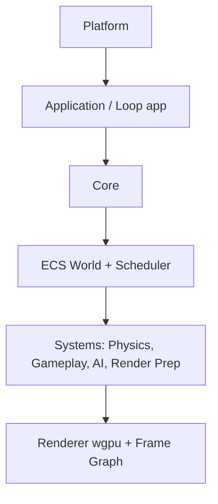

# Architecture Overview

rustgine is designed for performance, safety, and modularity. Its architecture is built around a data-oriented Entity Component System (ECS), a parallel system scheduler, and a modern GPU-driven renderer.

## High-Level Flow



- **CPU simulation is parallelized** using a dependency-aware scheduler.
- **GPU submission is explicit** and deterministic.
- **Rendering** is driven by ECS data extraction.

## Crate Responsibilities

| Crate      | Responsibility                                 |
|------------|------------------------------------------------|
| core       | Glue, shared abstractions, engine state        |
| ecs        | World, entities, archetypes, queries           |
| scheduler  | System access analysis & parallel execution    |
| render     | GPU context, render graph, frame submission    |
| platform   | OS interaction, windowing, input               |
| math       | Math primitives                                |
| app        | Owns the main loop & execution policy          |

## Core Design Principles

- **Data-Oriented Design**: Components are plain data, stored in cache-friendly archetypes. Systems operate over contiguous memory.
- **Explicit Multithreading**: Systems declare their data access. The scheduler builds a dependency graph and runs independent systems in parallel.
- **Clear Ownership**: No hidden globals or implicit mutable state. World, resources, and render context are passed explicitly.
- **Separation of Policy and Mechanism**: Low-level crates provide capabilities; the app layer defines when and how things run.

## The Engine Loop

The main loop is in the `app` crate. Example frame flow:

```bash
Frame Start
 ├── Poll OS Events
 ├── Update Time
 ├── Run Simulation Systems (parallel)
 ├── Extract Render Data (parallel)
 ├── Submit GPU Commands
 └── Present Frame
```

This design enables headless simulation, deterministic testing, and server/editor builds.

## Systems & Scheduling

Systems are defined as:

```rust
trait System {
    fn access(&self) -> SystemAccess;
    fn run(&mut self, world: &World, resources: &Resources);
}
```

The scheduler builds a conflict graph, finds independent sets, and runs systems in parallel without locks.

## Rendering Philosophy

- WebGPU-first via wgpu
- Explicit resource lifetimes
- Frame-graph driven passes
- CPU-side culling and batching
- GPU-friendly data layouts

Rendering is a consumer of ECS data, not a special-case system.

## Project Status

- Early-stage, experimental
- Focus: ECS, scheduler, windowing, WebGPU bootstrap
- Future: Physics, assets, editor, networking

## Why Rust?

- Eliminates data races by construction
- Safe parallelism
- Models complex ownership (CPU ↔ GPU)
- Catches engine bugs at compile time

---

For more, see the crate-level README files and code comments.
