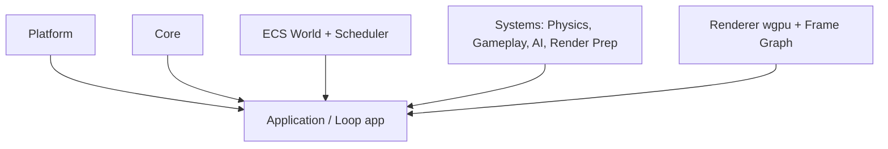

# Architecture Overview

rustgine is designed for performance, safety, and modularity. Its architecture is built around a data-oriented Entity Component System (ECS), a parallel system scheduler, and a modern GPU-driven renderer.

## High-Level Flow



- **CPU simulation is parallelized** using a dependency-aware scheduler.
- **GPU submission is explicit** and deterministic.
- **Rendering** is driven by ECS data extraction.

## Crate Responsibilities

| Crate      | Responsibility                                              |
|------------|-------------------------------------------------------------|
| core       | Config, tracing, `RustgineSystem` trait, shared abstractions|
| ecs        | World, entities, archetypes, queries                        |
| scheduler  | System access analysis & parallel execution                 |
| render     | GPU context, render graph, frame submission                 |
| platform   | OS interaction, windowing, input                            |
| math       | Math primitives                                             |
| app        | Main loop, subsystem lifecycle, graceful shutdown           |

## Core Design Principles

- **Data-Oriented Design**: Components are plain data, stored in cache-friendly archetypes. Systems operate over contiguous memory.
- **Explicit Multithreading**: Systems declare their data access. The scheduler builds a dependency graph and runs independent systems in parallel.
- **Clear Ownership**: No hidden globals or implicit mutable state. World, resources, and render context are passed explicitly.
- **Separation of Policy and Mechanism**: Low-level crates provide capabilities; the app layer defines when and how things run.

## The Engine Loop

The main loop lives in the `app` crate and orchestrates the full engine lifecycle:

```bash
Engine Lifecycle
 ├── Load Config
 ├── Initialize Tracing
 ├── Create AppState (config, shutdown signal, subsystem registry)
 ├── Register Subsystems (platform, render, scheduler, ...)
 ├── Startup Subsystems (in registration order)
 ├── Main Loop (wait for shutdown signal)
 │    └── Ctrl+C or internal trigger
 ├── Shutdown Subsystems (in reverse order)
 └── Exit
```

### Subsystem Lifecycle

Subsystems implement the `RustgineSystem` trait defined in `core`:

```rust
pub trait RustgineSystem: Debug {
    fn startup(&mut self) -> anyhow::Result<()>;
    fn shutdown(&mut self) -> anyhow::Result<()>;
}
```

Subsystems are registered via `AppState::register_system()` and managed with interior mutability (`Mutex`) to allow registration after `Arc` wrapping. Startup proceeds in registration order; shutdown proceeds in reverse order for correct dependency teardown.

### Graceful Shutdown

The `Shutdown` broadcaster coordinates termination across async tasks:

- **Ctrl+C (SIGINT)**: OS signal triggers shutdown
- **Internal trigger**: Any task can call `shutdown.trigger()`
- **Subscribers**: Tasks subscribe via `shutdown.subscribe()` to receive the signal

This design enables headless simulation, deterministic testing, and server/editor builds.

## Systems & Scheduling

### Engine Subsystems (`RustgineSystem`)

Long-lived subsystems (platform, render, scheduler) implement `RustgineSystem` for lifecycle management. They are started once at engine init and shut down at termination.

### Frame Systems (ECS)

Per-frame gameplay systems will be defined as:

```rust
trait System {
    fn access(&self) -> SystemAccess;
    fn run(&mut self, world: &World, resources: &Resources);
}
```

The scheduler builds a conflict graph, finds independent sets, and runs independent systems in parallel without locks.

## Rendering Philosophy

- WebGPU-first via wgpu
- Explicit resource lifetimes
- Frame-graph driven passes
- CPU-side culling and batching
- GPU-friendly data layouts

Rendering is a consumer of ECS data, not a special-case system.

## Project Status

- Early-stage, experimental
- Focus: ECS, scheduler, windowing, WebGPU bootstrap
- Future: Physics, assets, editor, networking

## Why Rust?

- Eliminates data races by construction
- Safe parallelism
- Models complex ownership (CPU ↔ GPU)
- Catches engine bugs at compile time

---

For more, see the crate-level README files and code comments.
